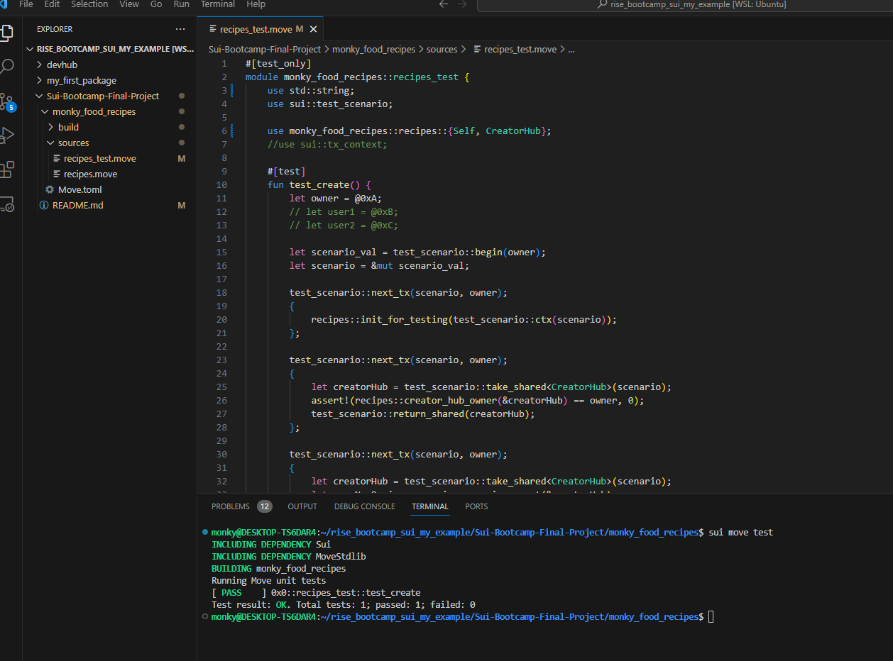

# Sui-Bootcamp-Final-Project

- Recipes for myself/others to add on the blockchain
- ID: 0x9a673c7f60f7acbd54268df205fbcfc96c9bfaa78837b5fcfdd1154542372d6a (CreatorHub)
- ID: 0xb92454aa4594e2b658f5746136e422ff5c6423c2a9996ac32990c98895e285d6 (Recipe)

How to build:
- curl --proto '=https' --tlsv1.2 -sSf https://sh.rustup.rs | sh
- rustup update stable
- sudo apt-get install curl git-all cmake gcc libssl-dev pkg-config libclang-dev libpq-dev build-essential
- cargo install --locked --git https://github.com/MystenLabs/sui.git --branch devnet sui
- For more information: https://docs.sui.io/guides/developer/getting-started/sui-install

How to run:
- sui move build
- deploy: sui client publish --gas-budget 20000000 .

How to test:
- inside the folder where Move.toml is located, type the command: sui move test

